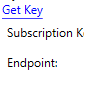
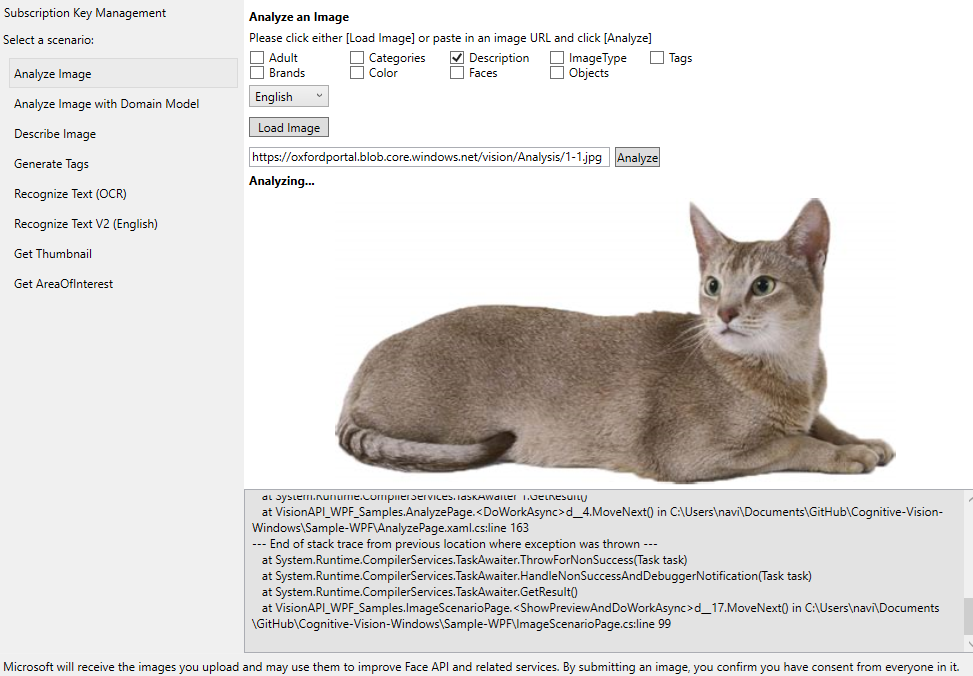
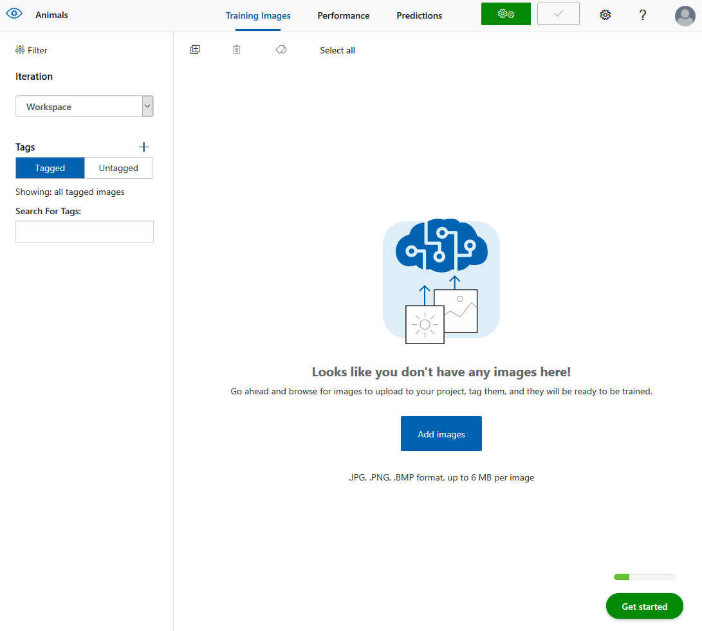
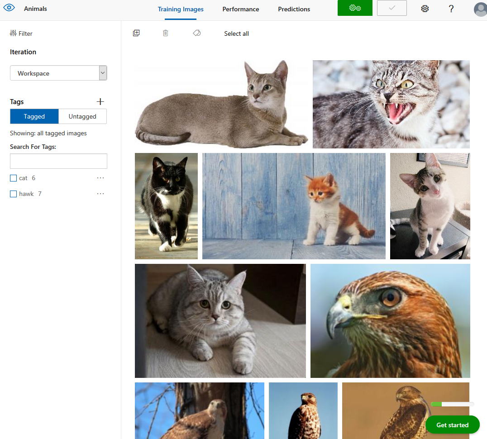
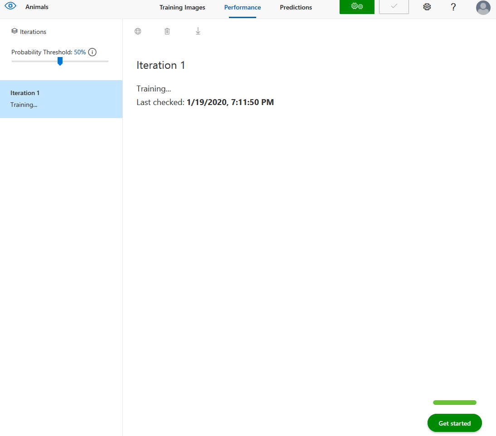
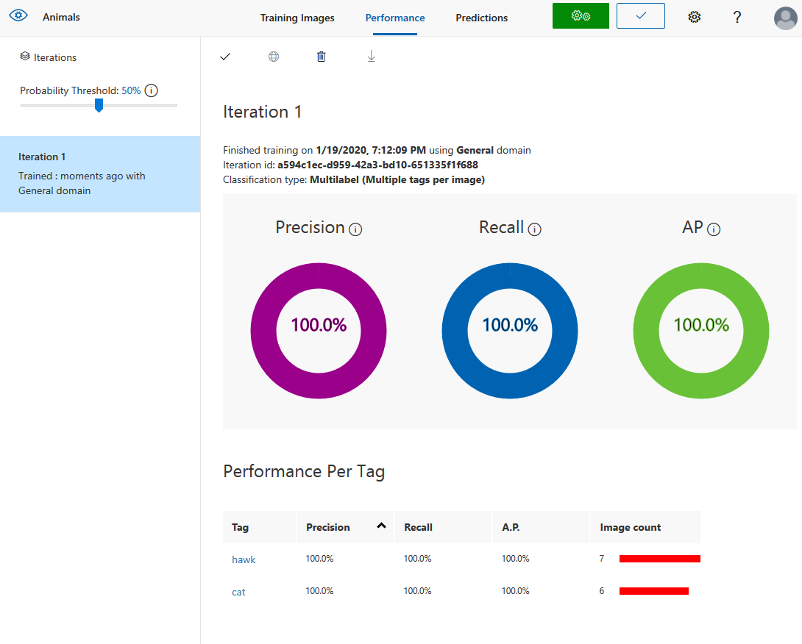
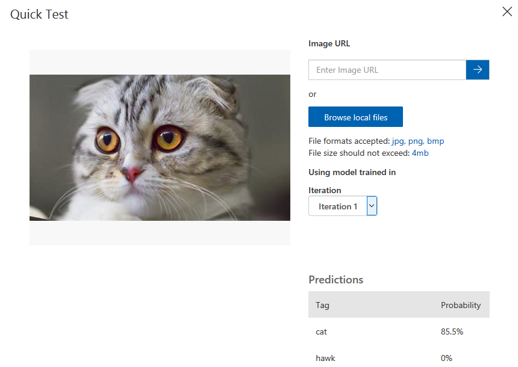
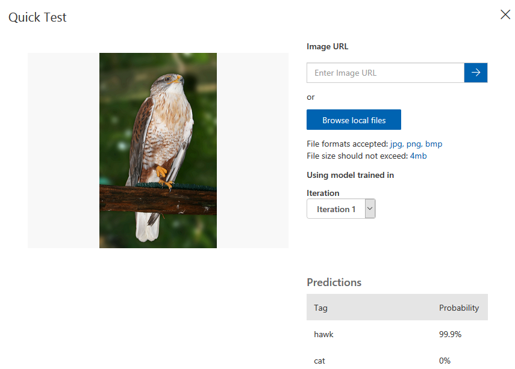

# IS-ND1

First I started out by downloading azure powered c#/.net application called Microsoft Project Oxford Vsion API, however even after inputting the right azure key the program wouldn't work.

It was stuck at Analyzing, I tried to build the program and run it through .exe with Administrator privileges to no avail.

As a next step I figured I'd try to use customvision.ai, registration process took quite a while but after that it wasn't that difficult.

After creating a new project called "Animals" and setting it's server provider I was able to upload the first images to the server.

First it requires to upload tagged images, for this project I chose to upload hawks and cats

After doing this you are required to train the given data through their servers.

Training results:

As we can see cat/hawk classification has worked perfectly.
